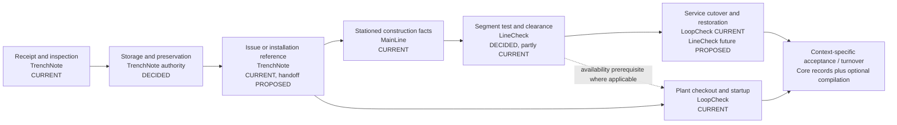

# Ecosystem lifecycle map

## Reading the map

**[CURRENT]** Labels in this document use the same evidence classification as
[Product boundary](product-boundary.md): `CURRENT` is confirmed repository
behavior, `DECIDED` is an accepted LineCheck direction, `PROPOSED` requires a
decision or implementation, and `UNKNOWN` identifies missing evidence.

**[DECIDED]** This is a map of cooperating applications, not one shared workflow.
Every application continues to operate against its own database when a sibling
or paid sidecar is unavailable.

**[DECIDED]** The dotted relationship is optional and project-specific. A
LineCheck clearance may be a prerequisite for plant startup, but neither product
derives or mutates the other's authoritative records.

## Stages, authority, and evidence

| Lifecycle stage | Authoritative application and fact | Evidence produced | Current consumer/handoff | Classification |
|---|---|---|---|---|
| Material or equipment received | TrenchNote `movements` records the received item/asset, destination, actor, server entry time, and optional receiving details. | Packing slip, delivery/damage photos, vendor/PO free text, and OSD note on the append-only movement. | No cross-product lifecycle event is implemented. | **CURRENT** |
| Inspected on receipt or while held | TrenchNote `inspections` records the asset, requirement, result, inspector, observation date, note, and optional photo. | Append-only inspection history; currency and warning state are derived. | No implemented mapping to a LoopCheck P&ID tag or MainLine/LineCheck subject. | **CURRENT** |
| Stored and preserved | TrenchNote owns physical location/custody; preservation belongs at this boundary. | Movement/location history is current; a purpose-built preservation log is not confirmed. | An untracked LoopCheck ADR proposes recurring tag preservation, creating an unresolved overlap. | Authority **DECIDED**; detailed workflow **UNKNOWN** |
| Released, issued, consumed, or installed by reference | A TrenchNote bulk `consume` movement authoritatively says material left stock; an asset movement says where a unique asset went. | Append-only movement and any attached delivery evidence. | It carries no stable installed-work identifier and emits no handoff manifest. | Fact **CURRENT**; handoff **PROPOSED** |
| Existing condition located/potholed | MainLine owns stationed pothole/SUE findings within an alignment. | Station/offset, crew/date/ticket, found utility facts, conflict note, photos, and append-only correction chain. | No versioned handoff into LineCheck or a design-resolution system is implemented. | **CURRENT** |
| Joint or linear component constructed | MainLine owns joint identity and append-only fusion/weld execution records. | Operator/qualification, pipe and process parameters, visual result, photos, data-logger file, and correction links. | LineCheck has no current importer or prerequisite reference. | **CURRENT** |
| Joint tested or repaired/retested | MainLine owns append-only joint test/NDT events and their reports. | Test type/date/result, agency, report files, repair note, `retest_of`, and `supersedes`. | The proposed useful handoff is a sourced joint-test fact; no contract exists. | Fact **CURRENT**; handoff **PROPOSED** |
| Linear segment pressure tested | LineCheck is the decided authority for project-method pressure-test records. Compile-time DTOs and pure domain/canonicalization helpers exist, but no durable field service exists. | Intended evidence includes raw readings, explicit units, method/version, calculation inputs/results, attachments, attestation, canonical snapshot, hash, and lock. | LoopCheck has local segment schema/templates and MainLine has `hydro_section` tests, but neither is semantically equivalent. | Ownership **DECIDED**; primitives partly **CURRENT**; overlaps **CURRENT** |
| Flushed, disinfected, and sampled | LineCheck roadmap assigns these segment records to open-source core. | Proposed versioned method, residual/sample observations, custody context, and attached lab result with provenance. | No implementation or cross-product event exists. | **DECIDED** scope; **PROPOSED** implementation |
| Cleared for service | LineCheck will derive readiness from required pressure/flushing/disinfection/sample evidence plus an explicit authorized clearance. | Intended frozen clearance/acceptance record and basic package; software does not itself grant authority. | No current implementation. A future event may inform plant startup or service cutover. | **DECIDED** scope; **PROPOSED** implementation |
| Customer service noticed, re-served, metered, tied over, and restored | LoopCheck currently owns service records and six any-pass-wins phase histories. LineCheck is the proposed future authority for new projects. | LoopCheck notice/check items, photos, meter/tie-over entries, punch links, and print board. | No versioned export/import or authority-transfer manifest exists. | LoopCheck **CURRENT**; LineCheck ownership **PROPOSED** |
| Plant asset checked out | LoopCheck owns tag/system check execution and punch evidence. | Frozen prompts/results, test-equipment note, attachments, timestamps, and open/closed punch attribution. | LoopCheck Lookahead reads derived standing over HTTP for planning constraints. | **CURRENT** |
| Plant system started and functionally tested | LoopCheck owns startup, functional/performance, training, LOTO visibility, and plant-system readiness facts. | Append-only checks/events plus derived readiness and print views. | Optional sidecar reads; no ecosystem lifecycle event contract is implemented. | **CURRENT** |
| Accepted or turned over | Each core owns its own acceptance evidence; there is no universal acceptance record. | LineCheck has a snapshot interface and generic hash helpers but no builder/persistence; LoopCheck turnover/signing is active uncommitted work; MainLine has live print outputs but no frozen snapshot. | Optional Lookaheads may compile or distribute without becoming authority. | Mixed **CURRENT/PROPOSED**; exact cross-product package **UNKNOWN** |

## Authoritative facts versus derived states

| Context | Authoritative facts | Derived states | Classification |
|---|---|---|---|
| TrenchNote | Append-only movements, readings, inspections, and attached receiving evidence. | Current asset location, stock-on-hand, latest meter reading, and inspection currency. | **CURRENT** |
| MainLine | Append-only potholes, construction records, joint tests, correction/retest links, and attached files. | Superseded record set, latest governing joint test, joint acceptance display, and alignment completion. | **CURRENT** |
| LineCheck | DTO/domain representation of pressure-test inputs, readings, evidence, calculation result, attestation, signed snapshot, and audit events. | Test result, lock/void disposition, and eventual segment clearance under project requirements. | Code **CURRENT**; durable authority **PROPOSED** |
| LoopCheck | Append-only checks/check items/attachments/LOTO events, mutable punch closure facts, and living registries/templates. | Required phases, any-pass-wins phase standing, tag/system readiness, active locks, and service cutover standing. | **CURRENT** |
| Lookahead | Mutable plan, configuration, delivery state, and sidecar-only commercial facts where explicitly owned. | Portfolio summaries, alerts, schedule readiness, and compiled presentation. | **CURRENT** in existing sidecars; LineCheck sidecar **UNKNOWN** |

**[DECIDED]** Derived state stays reproducible from the authoritative facts and
the declared rule/version. A consumer may cache a summary but must not present
that copy as the source record.

## Explicit handoff points

### TrenchNote to construction or acceptance applications

**[CURRENT]** The natural edge is an issue/consume/installation movement, but
the record has no project-wide public identity or installed-work reference.

**[PROPOSED]** A future handoff should state which material/asset was issued or
installed, when, from which TrenchNote instance/record, and which receiving
project/subject reference was selected. TrenchNote remains authoritative for
custody history; the receiving application owns its construction or acceptance
record.

### MainLine to LineCheck

**[CURRENT]** MainLine can prove that a stationed joint was constructed and
tested. LineCheck can represent a physical test segment and project-method
pressure record, but no integration exists.

**[PROPOSED]** MainLine should export sourced construction/joint-test facts or a
construction-complete manifest that LineCheck may reference as prerequisites.
LineCheck must not reinterpret MainLine's "latest test wins" display as a
project-complete segment acceptance.

### LineCheck to LoopCheck

**[UNKNOWN]** Some projects may require a cleared pipeline or service before a
plant system can start, but no repository defines the universal dependency.

**[PROPOSED]** Where a project declares that dependency, LoopCheck may consume a
versioned LineCheck clearance fact as a read-only prerequisite with source and
freshness. It must not write LineCheck clearance or embed LineCheck's database
ID as an undocumented relation.

### Service-cutover authority transfer

**[CURRENT]** LoopCheck remains authoritative for service records it currently
creates. Its service registry, contact split, check ledger, attachments, punch
links, and printed URLs must remain usable.

**[PROPOSED]** A per-project handoff would designate a future-write owner and a
cutover time. Historical LoopCheck facts remain immutable at their source;
LineCheck imports provenance-preserving copies or references and becomes
authoritative only for new events after the approved transition.

### Core applications to Lookahead

**[DECIDED]** A sidecar consumes public, versioned contracts under scoped
credentials. It may aggregate, schedule, notify, render, or manage operations;
it does not read SQLite, mutate signed evidence, or become the sole place where
an operator can obtain a basic record.

## Handoff envelope requirements

**[PROPOSED]** No ecosystem handoff envelope is implemented. Before the first
integration, a handoff should include at least:

- **[PROPOSED]** contract/type version and producer application/version;
- **[PROPOSED]** immutable source public ID plus source-local record ID for
  forensic lookup;
- **[PROPOSED]** source project public ID and explicitly selected destination
  project/subject mapping;
- **[PROPOSED]** occurrence time, export time, actor/device provenance where
  appropriate, and an idempotency key;
- **[PROPOSED]** authoritative fact payload with explicit units and method/rule
  versions rather than display text alone;
- **[PROPOSED]** evidence metadata, digest, retrieval/export reference, and an
  explicit statement of whether bytes are embedded;
- **[PROPOSED]** supersession/void/replacement links and the source record's
  authority status;
- **[PROPOSED]** importer identity, import time, mapping decision, and outcome.

**[DECIDED]** File export/import is an acceptable first transport. No broker,
shared package, central identity service, or online cross-product transaction is
required.
